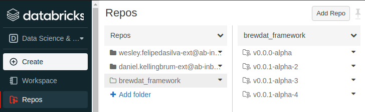
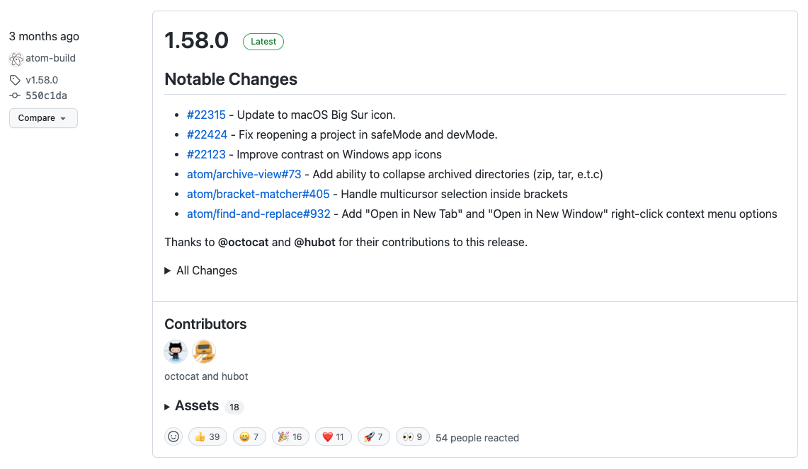

# ADB framework versioning and distribution

Created: May 13, 2022 10:24 AM
Epic: Data engine

# Motivation

In ESA, we intend to provide data engineers with notebook templates and libraries that they can leverage to accelerate the development process -- extracting data to the Raw Layer, ingesting it into the Bronze Layer, ingesting it into the Silver Layer, and finally creating Gold data products based on that data, all while using best practices for auditing, exception handling, dependency control, Data Lake organization, etc. One important aspect of these templates is that they will evolve over time, meaning newer versions will be release as new features become available (e.g., a new standard library function for running data quality checks, or a bugfix to an existing library function). These new template versions will be made available for ESA users; however, we should not overwrite the user's copy without their consent, as that could cause existing data pipelines to fail. Instead, we plan on maintaining the many template versions in a source control software (GitHub), using releases with semantic versioning to allow multiple versions of the same templates to coexist. The objective is to allow users to upgrade/downgrade their code at their own pace, after proper testing.

# Assumptions

1. All releases must be properly versioned and documented, in a way anyone can see what was introduced on each release;
2. ESA platform team is responsible for releasing new versions of the framework;
3. DE are responsible for choosing a framework version to work with, as well as upgrade/downgrade it on any of their developments after proper testing; 
4. All released versions of the framework should be automatically available to the ADB workspaces on DLZs through a CI/CD pipeline;

# DE experience using the framework

The available vesions of the framework would be found on every ADB workspace as a Repo under Repos/brewdat_framework/ :



Inside each repo, all artifacts of the framewok can be found: python modules and scripts, adb template notebooks, markdown documents, etc... Only admins users on that workspace can change these repos.

In order to start using the framework code on a custom notebook, the path for the framework version must be appended to sys path: 

```python
import sys
sys.path.append("/Workspace/Repos/brewdat_framework/v0.0.1-alpha-3")
```

Each notebook can reference a different version of the framework, even if they are running on the same cluster. 

To call some functionality of the framework the regular python import command is needed informing wich module/function is needed:

```python
from lakehouse.data_engineering import load_data, write_data

load_data()
write_data()
```

For upgrading the framework on existing artifacts, DE just need to change the imported path to the new released version, as well as running tests before releasing his code to production. 

# Framework versioning and release

All framework artifacts should be versioned on git repository, where all DE should be able to read it: [https://github.com/BrewDat/brewdat-pltfrm-ghq-tech-template-adb](https://github.com/BrewDat/brewdat-pltfrm-ghq-tech-template-adb)

The workflow for evolving the framework artifacts should follow the gitflow pattern, as discribed on [this article](https://www.atlassian.com/git/tutorials/comparing-workflows/gitflow-workflow) from Atlassian.


For every merge into master branch, a [github release](https://docs.github.com/en/repositories/releasing-projects-on-github/managing-releases-in-a-repository) and tag should be created. The release page should provide an overview on changes introduced by the new release. Through releases page, it is easy to compare releases and have a more in depth understanding on differences between versions of the framework.



Release and tags names should reference a framework version. Version numbers should obey semantic versioning best practices, with at least major and minor components (see: [https://semver.org/spec/v2.0.0.html](https://semver.org/spec/v2.0.0.html))

## CI/CD pipeline

### Unit tests

Every comit on any branch should trigger the pipeline that runs unit tests. 

Merging new code into develop and master branches should be allowed only when all unit tests ran successfully.

Unit tests should be written as much as possible, in order to get more stable releases.

### Delivery

Every new tag created for a any release should trigger the delivery process. The steps for the delivery pipeline are:

- List all existing ADB workspaces on ESA platform;
- List all existing tags on framework repo;
- For every combination of tag and ADB workspace:
    - check if there is already a repo referencing the tag on ADB workspace
        - when not, add a new repo to the ADB workspace and attach it to the tag

Assumptions:

- The pipeline agent must have permissions to list ADB workspaces on every subscription of ESA;
- The pipeline agent must have permissions to interact with every ADB workspace through the Repos API and Workspace API;
- Since the delivery is triggered by the tag creation event, when a new ADB workspace is created, the delivery pipeline must be triggered manually.

## Colaborative framework evolution

DE from DLZs can support the evolution of the framework by helping to validate not yet released versions or actively coding on feature branches.

For testing a unreleased version, the DE can add a repo under his personal folder and set the branch where the feature they want to validate is being developed (it could be either a hotfix, release, feature or develop branch).

## Outcomes

- Integrated to git and managed releases
- CI/CD pipelines
- Allow multiple versions of the framework to coexist on ADB workspace
- All framework artifacts are available to DE on ADB workspace
- DE can take part on framework development
- Unit tests can be integrated into the framework development workflow